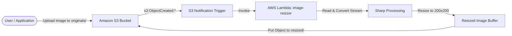

# Serverless Image Resizer (S3 + AWS Lambda + Terraform + GitHub Actions)

A production-grade, event-driven serverless image resizing pipeline built with **Node.js 22**, **Sharp**, **AWS Lambda**, **Amazon S3**, **Terraform**, and **GitHub Actions CI/CD**.

---

## 📐 Architecture Overview



### Key Workflow Steps
1. **Upload Trigger**: An image uploaded to `s3://<bucket-name>/originals/*` fires an S3 `s3:ObjectCreated:*` event notification.
2. **Lambda Processing**: The `image-resizer` Lambda function downloads the image stream from S3, converts the stream to a buffer using AWS SDK v3 stream helpers, and resizes it to a 200×200 max bounding box using `sharp`.
3. **Output Upload**: The scaled thumbnail is saved back to S3 under `s3://<bucket-name>/resized/*`.
4. **Recursion Safeguard**: The Lambda handler verifies object keys to ignore uploads outside `originals/` (preventing infinite invocation loops).

---

## 📂 Repository Structure

```text
.
├── .github/
│   └── workflows/
│       └── deploy.yml        # CI/CD deployment pipeline for Lambda & Terraform
├── image-resizer/
│   ├── index.mjs             # Main AWS Lambda ES Module handler
│   ├── package.json          # Node.js dependencies (Sharp & AWS SDK v3)
│   └── package-lock.json     # Dependency lockfile
├── terraform/
│   ├── main.tf               # S3 bucket, IAM roles, Lambda function & trigger resources
│   ├── variables.tf          # Terraform input variables
│   ├── outputs.tf            # Terraform output definitions
│   └── terraform.tfvars.example # Template for local environment variables
├── .gitignore                # Git ignore patterns (ignores tfstate, tfvars, node_modules, zips)
└── README.md                 # Project documentation
```

---

## 🚀 Prerequisites & Tools

- **Node.js**: `v22.x` or higher
- **Terraform**: `v1.5.0` or higher
- **AWS CLI**: `v2.x` configured with an IAM user or role
- **AWS Account**: Active AWS account with permissions for S3, IAM, CloudWatch, and Lambda

---

## 🛠️ Infrastructure Setup (Terraform)

Infrastructure is managed entirely through Terraform HCL under the `terraform/` directory.

### 1. Configure Local Variables
Copy the example variables file:
```bash
cp terraform/terraform.tfvars.example terraform/terraform.tfvars
```
Update `terraform/terraform.tfvars` with your AWS credentials:
```hcl
aws_access_key = "YOUR_AWS_ACCESS_KEY_ID"
aws_secret_key = "YOUR_AWS_SECRET_ACCESS_KEY"
```

> ⚠️ **Security Warning**: `terraform.tfvars` contains sensitive credentials and is automatically ignored by `.gitignore`. **Never** commit `.tfvars` files to version control.

### 2. Initialize & Apply Infrastructure
```bash
cd terraform

# Initialize providers (AWS & Archive)
terraform init

# Validate HCL syntax
terraform validate

# Provision infrastructure
terraform apply
```

---

## 🔄 CI/CD Automation (GitHub Actions)

Deployments are fully automated via GitHub Actions in [`.github/workflows/deploy.yml`](.github/workflows/deploy.yml).

### Triggers
- **Automatic**: Triggered on push to `main` branch whenever files under `image-resizer/**` or `terraform/**` change.
- **Manual**: Can be triggered manually via `workflow_dispatch` from the GitHub Actions UI.

### Required GitHub Repository Secrets

Configure the following secrets under **Settings > Secrets and variables > Actions**:

| Secret Name | Description |
|---|---|
| `AWS_ACCESS_KEY_ID` | AWS Access Key for Lambda deployment |
| `AWS_SECRET_ACCESS_KEY` | AWS Secret Access Key for Lambda deployment |
| `TERRAFORM_AWS_ACCESS_KEY_ID` | Dedicated AWS Access Key for Terraform Apply |
| `TERRAFORM_AWS_SECRET_ACCESS_KEY` | Dedicated AWS Secret Access Key for Terraform Apply |

---

## 🧪 Local Development & Testing

### 1. Install Node Dependencies
When installing `sharp` locally for Lambda execution on Linux, target the Linux x64 platform architecture:
```bash
cd image-resizer
npm ci --os=linux --cpu=x64
```

### 2. End-to-End Functional Test
Upload a test image to the `originals/` directory prefix:

```bash
# Upload sample image to S3
aws s3 cp sample.jpg s3://my-image-resizer-bucket-original/originals/sample.jpg
```

Verify that the resized output appears in `resized/`:
```bash
# List resized images
aws s3 ls s3://my-image-resizer-bucket-original/resized/
```

### 3. Real-Time Log Monitoring
Tail CloudWatch execution logs for the Lambda function:
```bash
aws logs tail /aws/lambda/image-resizer --follow
```

---

## 🛡️ Production Best Practices & Safeguards

1. **Least Privilege IAM Policies**: The Lambda function IAM role policy (`image-resizer-lambda-policy`) strictly grants `s3:GetObject` on `originals/*` and `s3:PutObject` on `resized/*` — omitting unnecessary bucket-level admin permissions.
2. **Infinite Recursion Guard**: Prefix filters in both Terraform (`filter_prefix = "originals/"`) and the Node.js handler code (`key.startsWith('resized/')`) prevent recursive execution.
3. **AWS SDK v3 Stream Utility**: Handled stream-to-buffer conversion via `streamToBuffer` helper to remain compatible across AWS SDK v3 stream implementations.
4. **Node 22 Runtime**: Configured with modern Node.js 22 runtime for optimal performance and long-term support.
